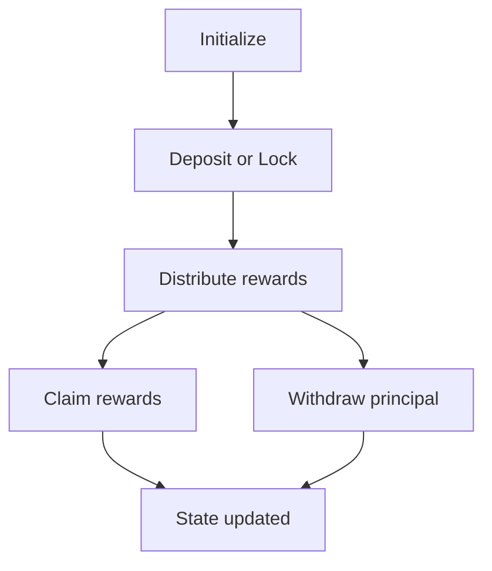
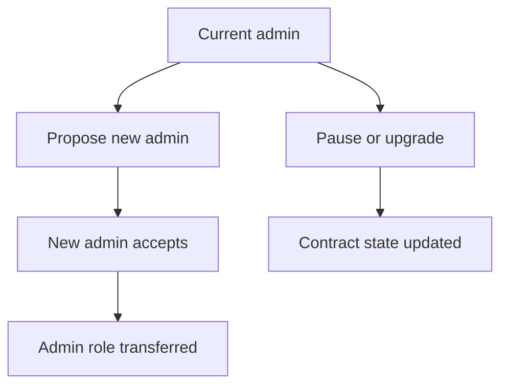

# Protocol Specification

This document is the formal specification for the Axionvera vault contract implemented in [../contracts/vault-contract/src/lib.rs](../contracts/vault-contract/src/lib.rs) and [../contracts/vault-contract/src/storage.rs](../contracts/vault-contract/src/storage.rs). It is intended for protocol review, future audits, and contributor onboarding.

## 1. Purpose and Scope

The vault contract implements a reward-bearing deposit primitive for Soroban. It supports:

- depositing an asset into the vault,
- withdrawing principal later,
- locking funds for a configurable duration,
- distributing rewards lazily through an index-based accounting model,
- claiming vested rewards,
- managing admin transitions, pause state, and contract upgrades.

The current implementation also includes multi-asset support for depositing and distributing rewards across supported assets.

## 2. Actors and Trust Model

- Admin: the privileged address allowed to distribute rewards, pause or unpause the contract, and initiate upgrades.
- User: an address that can deposit, withdraw, lock, unlock expired locks, and claim rewards.
- Token contracts: the deposit and reward token implementations, expected to honor standard token transfer semantics.
- Ledger/runtime: provides timestamps, authentication, and storage semantics.

The protocol assumes that:

- token contracts do not silently alter balances outside the declared transfer API,
- user authentication is enforced by the runtime,
- the admin is trusted to supply legitimate reward tokens and to act honestly,
- the contract’s reentrancy guard prevents callback-based state corruption.

## 3. State Model

### 3.1 Global state

The contract stores the following instance-level state:

- `admin`: privileged admin address
- `deposit_token`: asset accepted for deposits/withdrawals
- `reward_token`: asset distributed as rewards
- `total_deposits`: aggregate deposited principal across users
- `reward_index`: global reward index, monotonically increasing
- `vesting_period`: number of seconds before accrued rewards are fully vested
- `target_deposits`: baseline value used by the utilization multiplier curve
- `utilization_multipliers`: ordered curve points mapping utilization to reward multiplier
- `is_paused`: emergency pause flag
- `reentrancy_guard`: runtime guard to block recursive entry

### 3.2 User state

Each user has a persistent position with:

- `balance`: total deposited balance (liquid + locked)
- `reward_index`: the last global reward index the user was synced to
- `accrued_rewards`: rewards earned but not yet fully vested/claimed
- `last_reward_timestamp`: timestamp of the most recent reward accrual

Liquid balances are tracked separately from locked balances:

- `UserLiquidBalance(user)`: immediately withdrawable portion
- `UserLocks(user)`: list of lock entries with `{ amount, unlock_timestamp, reward_multiplier }`

## 4. Protocol Invariants

The contract enforces the following invariants:

1. Principal conservation:
   - the contract’s total deposits equal the sum of all user balances that are still active in the vault.
2. Reward index monotonicity:
   - `reward_index` never decreases.
3. Reward accrual safety:
   - rewards are accrued before any balance-changing operation so users cannot claim rewards for balances they did not hold.
4. Lock safety:
   - locked funds cannot be withdrawn until their lock expiry timestamp passes.
5. Authorization:
   - privileged operations require the admin or the relevant user to authenticate.
6. Reentrancy safety:
   - state mutations are guarded so nested calls cannot corrupt accounting.
7. Minimum reward distribution:
   - reward distributions below the minimum amount are rejected to prevent dust spam and unnecessary state churn.
8. Initialization safety:
   - the contract can only be initialized once and must not accept duplicate token addresses.

## 5. State Transition Model

### 5.1 Initialization

Flow:

1. The contract is initialized once with admin, deposit token, reward token, vesting period, target deposits, and utilization multipliers.
2. The instance state is set and the pause flag is cleared.
3. The contract emits an initialization event.

Preconditions:

- the contract must not already be initialized,
- deposit and reward tokens must be distinct,
- utilization multiplier points must be non-decreasing.

### 5.2 Deposit flow

Flow:

1. The caller authenticates.
2. The contract accrues any pending rewards for the user based on the prior balance.
3. The deposit token is transferred into the contract.
4. The user’s liquid balance and total deposits increase.
5. The user’s reward snapshot is updated.

Important note:

- reward accrual occurs before the balance mutation so the user is credited only for the balance that existed before the deposit.

### 5.3 Withdraw flow

Flow:

1. The caller authenticates.
2. The contract accrues any pending rewards for the user.
3. Any expired locks are moved back into liquid balance up to a small processing limit.
4. The contract checks that the user has sufficient liquid balance.
5. Principal is reduced and the deposit token is transferred back to the user.

Important note:

- withdrawals operate against liquid balance; locked funds remain inaccessible until expiry.

### 5.4 Lock flow

Flow:

1. The caller authenticates.
2. Rewards are accrued before changing the balance distribution.
3. The requested amount is moved from liquid balance into a new lock.
4. The lock records the unlock timestamp and a placeholder multiplier value.

Important note:

- the lock does not change the total deposits field because the principal remains in the vault.

### 5.5 Unlock-expired flow

Flow:

1. The caller authenticates.
2. The contract iterates through existing locks and moves any expired ones back to liquid balance.
3. The lock list is pruned accordingly.

Important note:

- processing is capped per call to avoid budget exhaustion.

### 5.6 Reward distribution flow

Flow:

1. The admin authenticates.
2. The contract accepts reward tokens from the admin.
3. The contract computes the reward index increment using the current total deposits.
4. The global reward index is advanced.
5. The new reward index is emitted to the runtime state.

The reward increment is computed as:

$$
\text{increment} = \frac{\text{effective\,reward} \times 10^9}{\text{total\_deposits}}
$$

where `effective_reward` is the distribution amount adjusted by the current utilization multiplier.

### 5.7 Claim flow

Flow:

1. The user authenticates.
2. The contract accrues any newly earned rewards.
3. The vested portion is calculated based on the time elapsed since the last reward accrual.
4. The vested amount is transferred to the user.
5. The user’s accrued reward balance is reduced accordingly.

The vesting logic is:

$$
\text{vested} = \min\left(\text{accrued\_rewards}, \left\lfloor \frac{\text{accrued\_rewards} \times \Delta t}{\text{vesting\_period}} \right\rfloor\right)
$$

when `vesting_period > 0`.

## 6. Reward Accounting Semantics

The reward model is index-based and lazy. The contract does not iterate over all users on every reward distribution. Instead, it updates a global reward index and lets each user realize their share when they next interact.

For a user with balance $B$ and reward indices $I_u$ and $I_g$:

$$
\text{accrued} = B \times \frac{I_g - I_u}{10^9}
$$

This formula is applied before balance mutations, which prevents reward theft and ensures that rewards belong to the balance that actually earned them.

### Utilization multiplier

Reward distributions are optionally scaled by a utilization-based multiplier curve:

$$
\text{effective\_amount} = \text{amount} \times \frac{\text{multiplier\_bps}}{10000}
$$

If no target deposits or multipliers are configured, the default multiplier is $1.0\times$.

## 7. Function Reference

### `version()`

Returns the contract version as a `u32`.

### `initialize(...)`

Initializes the contract once and stores global configuration.

### `propose_new_admin(...)` / `accept_admin(...)`

Implement a two-step admin handoff. The current admin proposes a new admin, and the proposed admin accepts the role.

### `deposit(...)`

Transfers deposit tokens into the vault and increases the user’s liquid balance.

### `withdraw(...)`

Transfers deposit tokens back to the user from liquid funds after processing any expired locks.

### `lock(...)`

Moves funds from liquid balance into a new time lock.

### `unlock_expired(...)`

Moves expired locks back into liquid balance.

### `distribute_rewards(...)`

Transfers reward tokens into the vault and advances the global reward index.

### `claim_rewards(...)`

Transfers the user’s vested rewards out of the vault.

### `pause_contract()` / `unpause_contract()`

Toggle the emergency pause flag.

### `upgrade(...)`

Replaces the contract’s wasm with a new implementation.

### Multi-asset functions

The current implementation also exposes asset-scoped variants:

- `add_asset(...)`
- `deposit_asset(...)`
- `withdraw_asset(...)`
- `distribute_rewards_for_asset(...)`
- `claim_rewards_for_asset(...)`
- `balance_of_asset(...)`
- `total_deposits_of_asset(...)`
- `reward_index_of_asset(...)`
- `pending_rewards_for_asset(...)`
- `vested_rewards_for_asset(...)`

## 8. Security Assumptions and Failure Modes

The protocol assumes the following security conditions:

- authentication is enforced by the runtime,
- token contracts implement standard transfer semantics,
- the admin does not drain reward funds unexpectedly,
- the contract is upgraded only through a controlled admin process,
- the reentrancy guard prevents recursive contract entry.

The protocol also handles common failure cases explicitly:

- insufficient principal balance for withdrawals,
- insufficient reward balance for claims,
- invalid or duplicate token configuration,
- reentrant calls,
- overflow and underflow conditions,
- invalid lock durations,
- unsupported assets in multi-asset flows.

## 9. Protocol Diagrams

### Deposit and reward claim lifecycle



### Admin transfer and upgrade lifecycle



## 10. Audit Checklist

An audit should verify:

- reward accrual occurs before balance changes,
- user balances and total deposits remain consistent,
- lock expiry handling cannot create free liquidity,
- the admin cannot bypass authentication,
- reward claims never exceed the contract’s available reward balance,
- pause and upgrade paths are constrained to the admin.

This specification should be read alongside [contract-storage.md](contract-storage.md) for the detailed storage layout and [../contracts/vault-contract/src/test.rs](../contracts/vault-contract/src/test.rs) for executable examples of expected behavior.

- Requires `admin` authorization.
  Important rules:
- can only run once
- requires `admin` authorization

Example:

```rust
vault.initialize(&admin, &deposit_token_id, &reward_token_id);
```

### `deposit(from, amount) -> Result<(), VaultError>`

Moves deposit tokens from the user into the vault and increases their recorded **liquid** vault balance.

Validations:

- `amount > 0`
- Requires `from` authorization
- Fails with `InsufficientBalance` if `from` does not hold enough `deposit_token`

Accounting:

- Accrues any pending rewards for `from` before changing their balance.
- Rejects invalid transfers before mutating user reward snapshots or vault balances.
  Step-by-step:

1. Confirms the contract is initialized.
2. Validates `amount > 0`.
3. Requires authorization from `from`.
4. Accrues any rewards already owed to `from`.
5. Transfers `deposit_token` from the user into the contract.
6. Increases `user_liquid_balance(from)`.
7. Increases `total_deposits`.
8. Emits a `deposit` event.

Why reward accrual happens first:

- the user should receive rewards based on their old balance up to this point in time
- only after that should the new deposit affect future distributions

Example:

```rust
vault.deposit(&user, &400);
assert_eq!(vault.balance(&user), 400);
assert_eq!(vault.total_deposits(), 400);
```

### `withdraw(to, amount) -> Result<(), VaultError>`

Moves deposit tokens from the vault back to the user from their **liquid** balance.

Step-by-step:

Validations:

- `amount > 0`
- Requires `to` authorization
- Fails with `InsufficientBalance` if `amount > liquid_balance(to)`
- Fails with `InsufficientContractBalance` if the vault cannot cover the token transfer

Accounting:

- Accrues any pending rewards for `to` before changing their balance.
- Final state is only written after token transfer pre-checks succeed.

1. Confirms the contract is initialized.
2. Validates `amount > 0`.
3. Requires authorization from `to`.
4. Accrues any rewards already owed to `to`.
5. **Processes expired locks for `to`**, updating their liquid balance.
6. Checks the user has enough **liquid** deposited balance.
7. Decreases `user_liquid_balance(to)`.
8. Decreases `total_deposits`.
9. Transfers `deposit_token` back to the user.
10. Emits a `withdraw` event.

Fails when:

- the amount is zero or negative
- the user tries to withdraw more than their **liquid** balance

Example:

```rust
vault.deposit(&user, &400);
vault.withdraw(&user, &150);

assert_eq!(vault.balance(&user), 250);
assert_eq!(vault.total_deposits(), 250);
```

**Exit Liquidity Guarantee**: This function is **isolated from reward claiming**. It handles only the deposit token and never touches the reward token. This ensures users can always withdraw their deposits even if the reward token contract fails or is paused.

### `distribute_rewards(amount) -> Result<i128, VaultError>`

Transfers reward tokens from the admin into the contract and updates the global reward index.

Step-by-step:

Validations:

- `amount > 0`
- Requires `admin` authorization
- Fails with `NoDeposits` if `total_deposits == 0`
- Fails with `InsufficientBalance` if `admin` does not hold enough `reward_token`

1. Confirms the contract is initialized.
2. Validates `amount > 0`.
3. Requires admin authorization.
4. Verifies `total_deposits > 0`.
5. Transfers `reward_token` from the admin into the contract.
6. Computes the reward-index increment.
7. Updates the global `reward_index`.
8. Emits a `distrib` event.
9. Returns the new `reward_index`.

Important behavior:

- this does not immediately transfer rewards to users
- it only updates global accounting so users can realize rewards later

Example:

```rust
let next_index = vault.distribute_rewards(&400);
assert!(next_index > 0);
```

### `claim_rewards(user) -> Result<i128, VaultError>`

Pays the user the rewards that have already accrued for them.

Step-by-step:

1. Confirms the contract is initialized.
2. Requires authorization from `user`.
3. Accrues any newly earned rewards into `user_rewards`.
4. Reads the current claimable amount.
5. Returns `0` immediately if nothing is claimable.
6. Resets `user_rewards(user)` to `0`.
7. Transfers `reward_token` from the contract to the user.
8. Emits a `claim` event when a transfer happens.

Validations:

- Requires `user` authorization
- Fails with `InsufficientContractBalance` if the vault reward pool is underfunded

**Isolation from Withdrawals**: This function is **completely separate from withdraw**. Users must call `claim_rewards` explicitly to receive their rewards. This design ensures:

1. **Exit Liquidity**: Users can always withdraw deposits via `withdraw()` even if reward claiming fails
2. **Reward Token Independence**: Failures in the reward token contract don't block deposit withdrawals
3. **Explicit Intent**: Users must actively claim rewards; they're not automatically bundled with withdrawals

Example:

```rust
let claimed = vault.claim_rewards(&user);
assert!(claimed >= 0);
```

**Recommended Usage Pattern**:

```rust
// Step 1: Withdraw deposits (always works)
vault.withdraw(&user, &amount);

// Step 2: Claim rewards separately (may fail if reward token has issues)
let rewards = vault.claim_rewards(&user);
```

This separation prioritizes **exit liquidity** over yield mechanics, ensuring users can always access their principal.

````

### `balance(user) -> Result<i128, VaultError>`

Returns the user's deposited vault balance.

### `total_deposits() -> Result<i128, VaultError>`

Returns the total amount of deposit tokens currently represented inside the vault.

### `reward_index() -> Result<i128, VaultError>`

Returns the current global reward index.

### `pending_rewards(user) -> Result<i128, VaultError>`

Returns the user's claimable rewards without mutating storage.

Example:

```rust
let pending = vault.pending_rewards(&user);
````

### `admin() -> Result<Address, VaultError>`

Returns the configured admin address.

### `deposit_token() -> Result<Address, VaultError>`

Returns the deposit token contract address.

### `reward_token() -> Result<Address, VaultError>`

Returns the reward token contract address.

## Events

The contract emits standardized Soroban events for all state-changing actions. Events follow a consistent structure to ensure reliable off-chain indexing.

### Event Structure

All vault events use a **two-topic design** for efficient filtering:

- **Topic 1 (Protocol Identifier)**: `Symbol("AxionVault")` — Identifies the protocol namespace
- **Topic 2 (Action)**: Identifies the specific action (e.g., `Symbol("Deposit")`, `Symbol("Withdraw")`)
- **Data Payload**: Structured tuple containing event-specific data (user_address, amount, timestamp)

This design allows indexers to rapidly filter by:

- Protocol identifier for vault-specific events
- Action type for specific state changes

**Important**: Dynamic data such as user addresses and amounts are **stored in the data payload, not in topics**, because topic space is highly constrained on Soroban.

### Event: `Initialize`

**Topics:**

- Topic 1: `Symbol("AxionVault")`
- Topic 2: `Symbol("Initialize")`

**Data Payload (XDR Struct):**

```rust
struct InitializeEvent {
    admin: Address,
    deposit_token: Address,
    reward_token: Address,
    timestamp: u64,
}
```

**Description:** Emitted once when the contract is initialized with protocol parameters.

### Event: `Deposit`

**Topics:**

- Topic 1: `Symbol("AxionVault")`
- Topic 2: `Symbol("Deposit")`

**Data Payload (XDR Struct):**

```rust
struct DepositEvent {
    user_address: Address,
    amount: i128,
    timestamp: u64,
}
```

**Description:** Emitted when a user deposits tokens. The `amount` field contains the deposit quantity. The `timestamp` field is set from the ledger at event emission time.

### Event: `Withdraw`

**Topics:**

- Topic 1: `Symbol("AxionVault")`
- Topic 2: `Symbol("Withdraw")`

**Data Payload (XDR Struct):**

```rust
struct WithdrawEvent {
    user_address: Address,
    amount: i128,
    timestamp: u64,
}
```

**Description:** Emitted when a user withdraws tokens from the vault. The `amount` field contains the withdrawal quantity. The `timestamp` field is set from the ledger at event emission time.

### Event: `Distribute`

**Topics:**

- Topic 1: `Symbol("AxionVault")`
- Topic 2: `Symbol("Distribute")`

**Data Payload (XDR Struct):**

```rust
struct DistributeEvent {
    caller: Address,
    amount: i128,
    timestamp: u64,
}
```

**Description:** Emitted when an admin distributes rewards to the vault. The `amount` field contains the total reward tokens distributed. The `caller` field is the admin account. The `timestamp` field is set from the ledger at event emission time.

### Event: `Claim`

**Topics:**

- Topic 1: `Symbol("AxionVault")`
- Topic 2: `Symbol("Claim")`

**Data Payload (XDR Struct):**

```rust
struct ClaimEvent {
    user_address: Address,
    amount: i128,
    timestamp: u64,
}
```

**Description:** Emitted when a user claims their accrued rewards. The `amount` field contains the reward quantity claimed. The `timestamp` field is set from the ledger at event emission time.

### Indexer Integration

Off-chain indexers should:

1. **Subscribe to events with Topic 1 = `Symbol("AxionVault")`** to catch all vault events
2. **Filter by Topic 2** to identify specific actions (Initialize, Deposit, Withdraw, Distribute, Claim)
3. **Parse the data payload** to extract user_address, amount, and timestamp
4. **Build the user dashboard** by aggregating Deposit, Withdraw, Distribute, and Claim events chronologically

### XDR Serialization

Each event data payload is serialized as a Soroban ContractData XDR type. The indexer receives the full XDR envelope and must deserialize the data payload according to the struct definitions above.

Example (pseudocode):

```
event.topics[0] == Symbol("AxionVault")
event.topics[1] == Symbol("Deposit")
data = deserialize_xdr(event.data) as DepositEvent
// data.user_address, data.amount, data.timestamp are now available
```

## Errors

- `AlreadyInitialized`: vault initialization can only happen once.
- `NotInitialized`: the vault must be initialized before use.
- `InvalidAmount`: token amounts must be greater than zero.
- `InsufficientBalance`: the caller-facing token balance is lower than the requested amount.
- `NoDeposits`: rewards cannot be distributed while `total_deposits == 0`.
- `InvalidTokenConfiguration`: deposit and reward token addresses must be different.
- `InsufficientContractBalance`: the vault does not hold enough tokens to complete the transfer.
- `MathOverflow`: arithmetic overflow or underflow was detected while updating accounting.
  The contract can return the following errors from [errors.rs](../contracts/vault-contract/src/errors.rs):

- `AlreadyInitialized`
- `NotInitialized`
- `Unauthorized`
- `InvalidAmount`
- `InsufficientBalance`
- `MathOverflow`
- `NoDeposits`

## Typical End-to-End Flow

1. Deploy the contract.
2. Call `initialize`.
3. User A deposits.
4. User B deposits.
5. Admin calls `distribute_rewards`.
6. Users inspect `pending_rewards`.
7. Users call `claim_rewards`.

## Contributor Tips

- Read [contracts/vault-contract/src/lib.rs](../contracts/vault-contract/src/lib.rs) for the public API.
- Read [contracts/vault-contract/src/storage.rs](../contracts/vault-contract/src/storage.rs) for accounting internals.
- Start with the tests in [contracts/vault-contract/src/test.rs](../contracts/vault-contract/src/test.rs) if you want executable examples.
